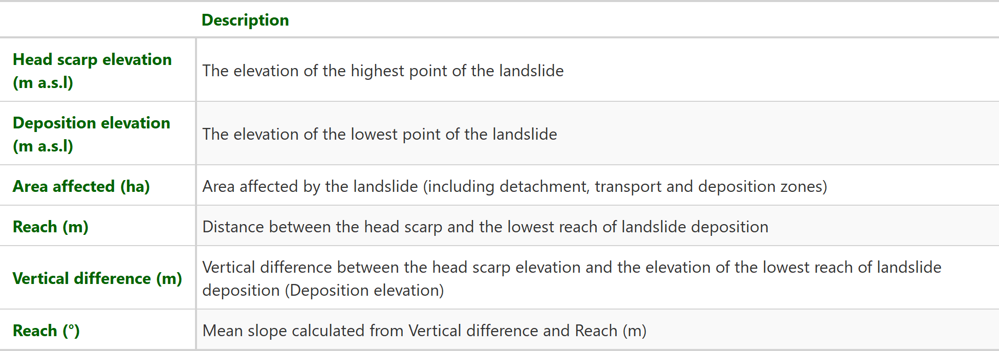

```{r setup, include=FALSE}
options(htmltools.dir.version = FALSE)
knitr::opts_chunk$set(
  fig.width=9, fig.height=3.5, fig.retina=3,
  out.width = "100%",
  cache = FALSE,
  echo = FALSE,
  message = FALSE, 
  warning = FALSE,
  fig.show = TRUE,
  hiline = TRUE
)
```

```{r xaringan-themer, include=FALSE, warning=FALSE}
library(xaringanthemer)
library(xaringanExtra)
use_xaringan_extra(c("tile_view", "panelset"))
style_duo_accent(
  primary_color =  "#E59400",#"#1381B0",
  secondary_color = "#006400", #"#FF961C",
  inverse_header_color = "#FFFFFF",
  text_font_size = "13pt",
  header_h3_font_size = "24pt",
  title_slide_background_image = "figs/bg.jpg",
  footnote_font_size = '0.5em',
  footnote_position_bottom = "30px",
  extra_css = list(
    ".pull-left-70" = list("float" = "left", "width" = "65.8%"),
    ".pull-right-30" = list("float" = "right", "width" = "28.2%"),
    ".pull-left-35" = list("float" = "left", "width" = "32.9%"),
    ".pull-right-65" = list("float" = "right", "width" = "61.1%"),
    ".my-footer" = list(
        "position" = "absolute",
        "bottom" = "3px",
        "left" = "0px",
        "height" = "33px",
        "width" = "100%"
      )
  )
)
```


<div class="my-footer"><span>&emsp;<a href="http://creativecommons.org/licenses/by/4.0/"></a>
&emsp;&emsp;&emsp;&emsp;&emsp;&emsp;&emsp;&emsp;&emsp;&emsp;&emsp;&emsp;&emsp;
&emsp;&emsp;&emsp;&emsp;&emsp;&emsp;&emsp;&emsp;&emsp;&emsp;&emsp;&emsp;&emsp;
</span></div> 

### Study Area

.pull-left-35[
#### Rio Lucma Catchment

- **Location**: eastern side of the Cordillera Blanca.

- **Average rainfall** in the area: 1,169 mm/year, (80% during the rainy season i.e. November to April). 

- **Elevation difference**: 2,500 - 5,830 m a.s.l.

- **47 km** of simple unpaved roads were *recently* constructed to connect remote settlements.

- Located in a high relief landslide-prone area.

- Roads are rarely equipped with drainage or landslide mitigation measures. 
]

```{r, include = F}
library(sf)
library(tmap)
library(tidyverse)
aoi = st_read("geom/LUCMA_study_area.shp")
roads = st_read("geom/roads_lucma_2015.shp") %>% 
  mutate(year = factor(
      year,
      levels = c(2015, 2018), 
      labels = c("Existing roads", "Recently constructed roads")
    )
  )
tmap_mode("view")
tmap_options(
  basemaps = c(
    "OSM" = "OpenStreetMap", 
    "ESRI Imagery" = "Esri.WorldImagery",
    "ESRI Topo" = "Esri.WorldTopoMap"
  )
)
```

.pull-right-65[
```{r, out.height = 500, out.width = 650}
tm_shape(aoi, name = "Study area") +
  tm_borders(col = "red", lwd = 2) +
  tm_shape(roads, "Manually delineated roads") +
  tm_lines(
    title.col = "",
    col = "year",
    lwd = 2,
    palette = c("darkgreen", "orange")
  ) +
  tm_scale_bar() +
  tm_mouse_coordinates()
```
]

---
<div class="my-footer"><span>&emsp;<a href="http://creativecommons.org/licenses/by/4.0/"></a>
&emsp;&emsp;&emsp;&emsp;&emsp;&emsp;&emsp;&emsp;&emsp;&emsp;&emsp;&emsp;&emsp;
&emsp;&emsp;&emsp;&emsp;&emsp;&emsp;&emsp;&emsp;&emsp;&emsp;&emsp;&emsp;&emsp;
</span></div> 

### Landslides along the recently constructed roads 
- Several landslides were triggered due to road construction, which affected an approximate area of 32 ha. 

- We identified and characterised these landslides by combining field mapping, visual interpretation and semi-automated analysis of satellite imagery (PlanetScope and RapidEye-2).

```{r}

```

---
<div class="my-footer"><span>&emsp;<a href="http://creativecommons.org/licenses/by/4.0/"></a>
&emsp;&emsp;&emsp;&emsp;&emsp;&emsp;&emsp;&emsp;&emsp;&emsp;&emsp;&emsp;&emsp;
&emsp;&emsp;&emsp;&emsp;&emsp;&emsp;&emsp;&emsp;&emsp;&emsp;&emsp;&emsp;&emsp;
</span></div> 

### Landslide characteristics for three subset areas
- We investigated in detail three specific subsets, where we identified, delineated, and described **56 landslides**. 

- We derived quantitative (e.g., area, elevation of the headscarp and deposition, reach) and qualitative characteristics from these landslides, including their timing of concurrence with respect to road construction.

```{r}

```

---
<div class="my-footer"><span>&emsp;<a href="http://creativecommons.org/licenses/by/4.0/"></a>
&emsp;&emsp;&emsp;&emsp;&emsp;&emsp;&emsp;&emsp;&emsp;&emsp;&emsp;&emsp;&emsp;
&emsp;&emsp;&emsp;&emsp;&emsp;&emsp;&emsp;&emsp;&emsp;&emsp;&emsp;&emsp;&emsp;
</span></div> 

### Landslide quantitative characteristics

.panelset[
.panel[.panel-name[Results]
<center></center>
]
.panel[.panel-name[Descriptions]

]
]

---
<div class="my-footer"><span>&emsp;<a href="http://creativecommons.org/licenses/by/4.0/"></a>
&emsp;&emsp;&emsp;&emsp;&emsp;&emsp;&emsp;&emsp;&emsp;&emsp;&emsp;&emsp;&emsp;
&emsp;&emsp;&emsp;&emsp;&emsp;&emsp;&emsp;&emsp;&emsp;&emsp;&emsp;&emsp;&emsp;
</span></div> 

### Landslide qualitative characteristics

.panelset[
.panel[.panel-name[Results]

<center></center>
]

.panel[.panel-name[Categorization with respect to position to the road]
.pull-left[

]
.pull-right[
Schematic types of movements distinguished in this study. 

**(A)** Initial state before the construction of the road 

**(B)** Initial state after the construction of the road

**(C)** Pre-failure conditions 

**(D)** Post-failure states

**(1)** Landslides onto the road 

**(2)** Landslides downslope the road 

**(3)** complex landslides
]
]

.panel[.panel-name[Categorization according to landslide type]
Distinction between flow and slide types.

- Flow type: a landslide where the length to width ratio is > 3
- Slide type: a landslide where the length to width ratio is <= 3

]
]

---
<div class="my-footer"><span>&emsp;<a href="http://creativecommons.org/licenses/by/4.0/"></a>
&emsp;&emsp;&emsp;&emsp;&emsp;&emsp;&emsp;&emsp;&emsp;&emsp;&emsp;&emsp;&emsp;
&emsp;&emsp;&emsp;&emsp;&emsp;&emsp;&emsp;&emsp;&emsp;&emsp;&emsp;&emsp;&emsp;
</span></div> 

### Landslide occurrence 
.panelset[
.panel[.panel-name[Visual interpretation]

.pull-left[


]

.pull-right[
- We conducted a visual interpretation of satellite imagery on the [Planet Explorer online platform](https://www.planet.com/explorer/) to determine landslide occurrence and road construction dates. 

- Based on this interpretation we derived the timing of occurrence of the landslides as the number of days between road construction and landslide occurrence.

- Hence, the landslide occurrence and road construction dates in the following panels refer to the first time the landslide or the new road, respectively, was observed on VHR imagery.

]
]
.panel[.panel-name[Road construction and rainfall]
.pull-left[

- We analysed rainfall data from two stations of the [Servicio Nacional de Meteorología e Hidrología del Perú (SENAMHI)](https://www.senamhi.gob.pe/).

- **75%** of landslides were observed on satellite imagery simultaneously with road construction work.

- The remaining **25%** were identified between one week and seven months after the roads had been constructed.

- **51%** of the landslides were observed during the wet season (November to April).

- **41.1%** occurred during El Niño–Southern Oscillation (ENSO) strong cool phase or “La Niña” period.
]
.pull-right[

]
]
]

---
<div class="my-footer"><span>&emsp;<a href="http://creativecommons.org/licenses/by/4.0/"></a>
&emsp;&emsp;&emsp;&emsp;&emsp;&emsp;&emsp;&emsp;&emsp;&emsp;&emsp;&emsp;&emsp;
&emsp;&emsp;&emsp;&emsp;&emsp;&emsp;&emsp;&emsp;&emsp;&emsp;&emsp;&emsp;&emsp;
</span></div> 

### Final remarks
We observed that the majority of mapped landslides were directly (e.g., landslides resulting from slope undercutting) or indirectly associated with road constructions (e.g., rainfall-induced landslides resulting from a combination of extreme precipitation over slopes with decreased stability) and that the road constructions also may set preconditions for subsequent rainfall-triggered landslides.


---
<div class="my-footer"><span>&emsp;<a href="http://creativecommons.org/licenses/by/4.0/"></a>
&emsp;&emsp;&emsp;&emsp;&emsp;&emsp;&emsp;&emsp;&emsp;&emsp;&emsp;&emsp;&emsp;
&emsp;&emsp;&emsp;&emsp;&emsp;&emsp;&emsp;&emsp;&emsp;&emsp;&emsp;&emsp;&emsp;
</span></div> 

### Further work
Emmer, A., Hölling, D., Abad, L., Štěpánek, P., Zahradníček, P., Emmerova, I. (in revision). *Landslides Associated with Recent Road Constructions in the Río Lucma Catchment, Eastern Cordillera Blanca, Peru*. Submitted to Geomatics, Natural Hazards and Risk.

### Acknowledgements
This work was supported by the AUT-CZE MOBILITY project ‘Is the occurrence of slope movements in the Cordillera Blanca, Peru, influenced by the El Niño Southern Oscillation?’ (Project No. 8J18AT032 and CZ 04/2018, respectively).

Lorena Abad and Daniel Hölbling have also been supported by the Austrian Science Fund (FWF) through the project MORPH (Mapping, Monitoring and Modelling the Spatio-Temporal Dynamics of Land Surface Morphology; FWF-P29461-N29) and the Austrian Research Promotion Agency (FFG) through the project MontEO (The impact of mass movements on alpine trails and huts assessed by EO data; contract no. 873667).

### Contact 
`r anicon::faa("envelope", color = "#006400", animate="wrench", anitype="parent-hover",rtext = "    [**lorenacristina.abadcrespo@sbg.ac.at**](mailto:lorenacristina.abadcrespo@sbg.ac.at)")`

`r anicon::faa("twitter", color = "#006400", animate="wrench", anitype="parent-hover",rtext = "    [**@loreabad6**](https://twitter.com/loreabad6)")`

.pull-right[
.footnote[
Slides powered by [xaringan](https://github.com/yihui/xaringan),  [xaringanthemer](https://github.com/gadenbuie/xaringanthemer) & [xaringanExtra](https://github.com/gadenbuie/xaringanExtra)
]
]
